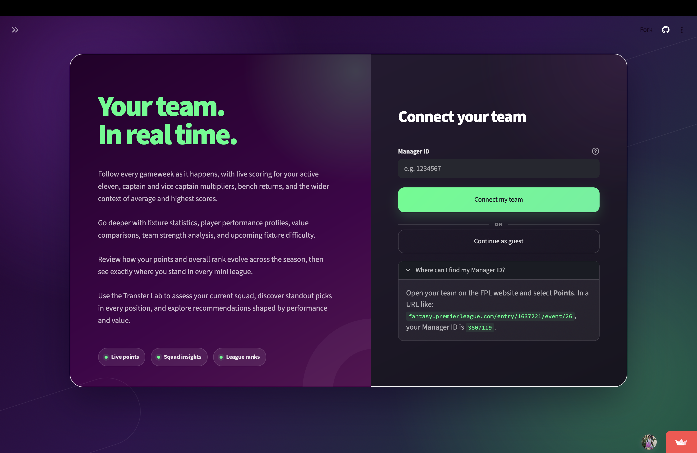
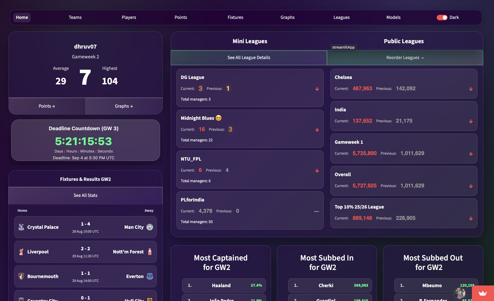
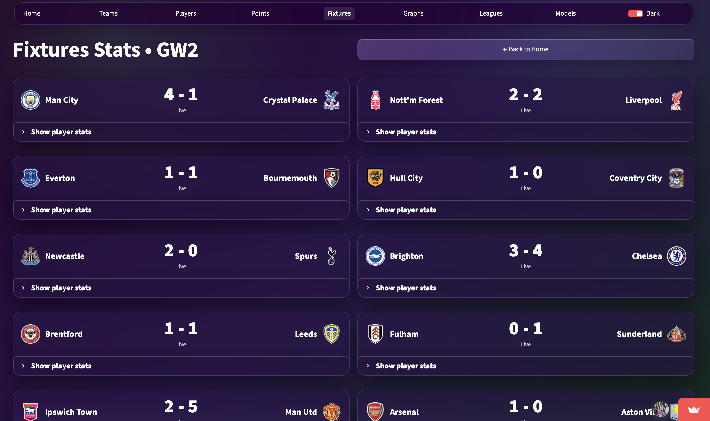
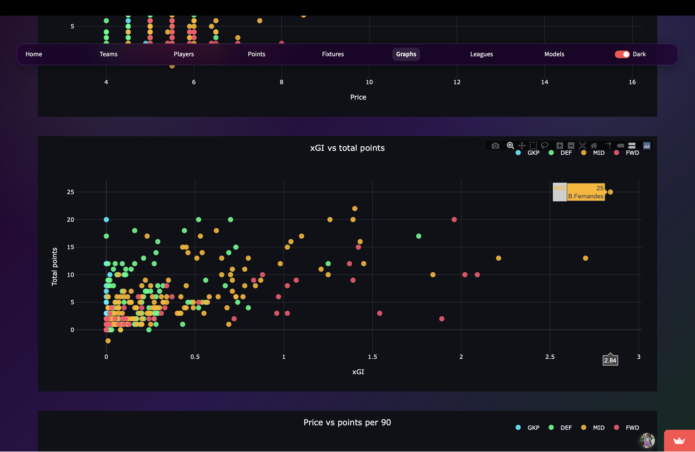
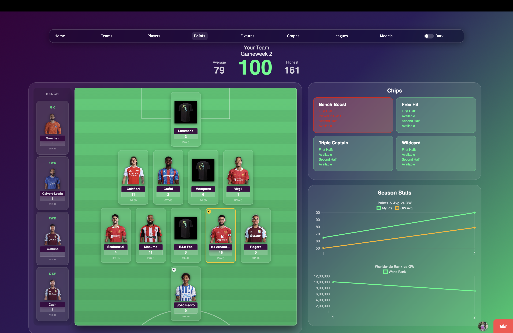
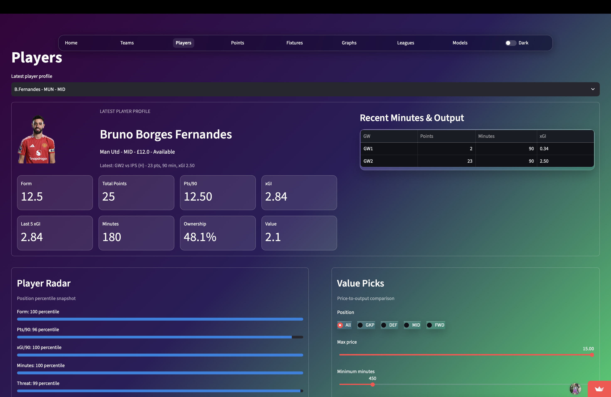
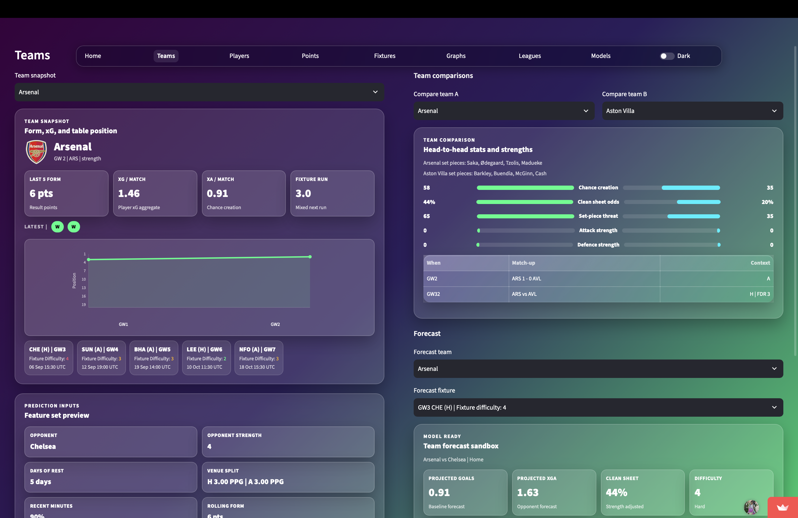
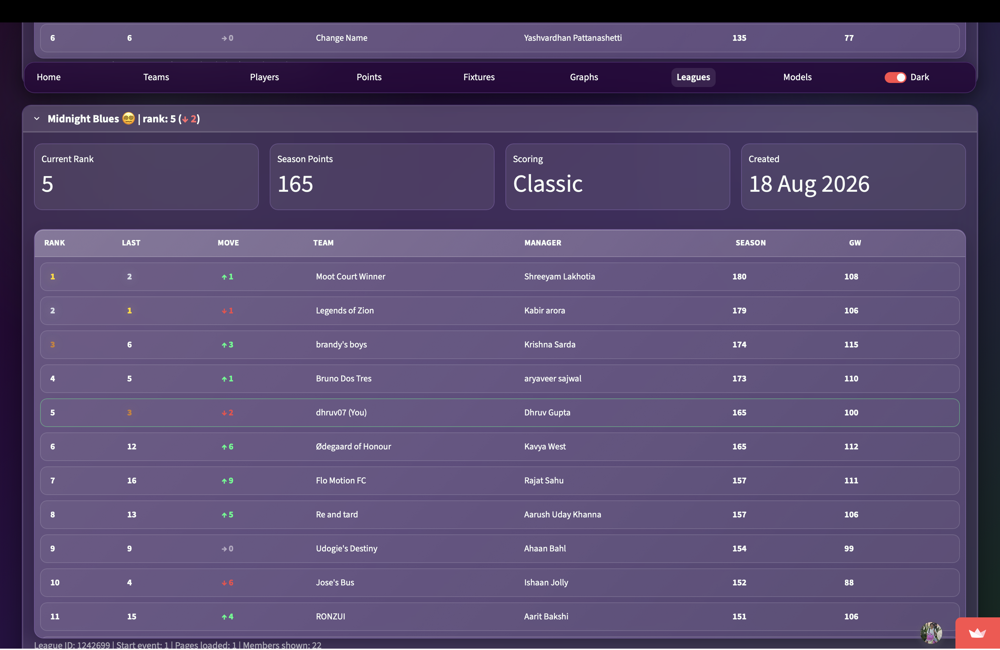
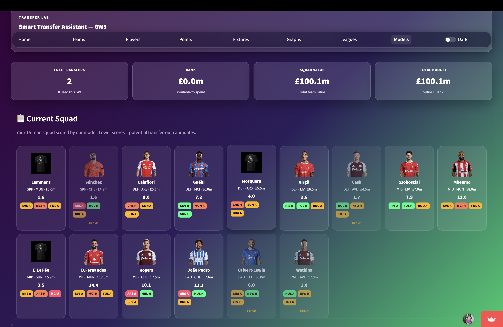

# FPL Manager Dashboard

A Streamlit app for tracking your Fantasy Premier League team in real time.

This project connects to the official FPL API, loads your squad from a manager ID, and shows a modern dashboard with live points, fixtures, and gameweek trends.

Live app: https://fplmanager.streamlit.app

## Features

- Connect using your FPL manager ID.
- Live gameweek points for your active XI.
- Captain/vice-captain handling and multipliers.
- Current gameweek context (average and highest points).
- Visual pitch layout and bench overview.
- Fixtures page with match stats and player stat chips.
- Graphs page for:
	- your points vs gameweek average
	- overall rank trend
- Lightweight local data utilities for bootstrap and player processing.

## Tech Stack

- Python 3.10+
- Streamlit
- FPL public API (fantasy.premierleague.com)
- Chart.js (embedded in Streamlit components)

## Screenshots

> Only a couple of screens are up for now — more will be added as the season progresses.

<table border="1" cellpadding="10" cellspacing="0">
  <tr>
    <td width="50%" valign="top" align="left">
      <b>Connect your team</b><br>
      Enter your Manager ID (or continue as a guest) to link your squad. Once connected, you can view all your team details including your stats.<br><br>
      
    </td>
    <td width="50%" valign="top" align="left">
      <b>Home dashboard</b><br>
      Live points, mini league standings, upcoming fixtures, and gameweek highlights like most captained/subbed players.
	  <br><br>
      
    </td>
  </tr>
  <tr>
    <td width="50%" valign="top" align="left">
      <b>Fixtures page</b><br>
      View current gameweek matches with detailed stats including team form, player injuries, and key performance indicators. See fixture difficulty ratings and upcoming matchups to inform your captain and transfer decisions.<br><br>
      
    </td>
    <td width="50%" valign="top" align="left">
      <b>Graphs</b><br>
      Track your and players individual performance trends with visual charts showing your points vs gameweek average and your overall rank progression throughout the season.<br><br>
      
    </td>
  </tr>
  <tr>
    <td width="50%" valign="top" align="left">
      <b>Points page</b><br>
      Detailed breakdown of your current gameweek points with a visual pitch layout showing your active XI and bench. See which players earned bonus points, clean sheets, and other scoring events.<br><br>
      
    </td>
    <td width="50%" valign="top" align="left">
      <b>Players page</b><br>
      Explore all FPL players with detailed stats, form history, and selection percentages. Filter by position, team, and performance metrics to find your next transfer targets.<br><br><br>
      
    </td>
  </tr>
  <tr>
    <td width="50%" valign="top" align="left">
      <b>Teams page</b><br>
      View team-level statistics including strength of schedule, average player value, and team form. Useful for planning your transfers and understanding team performance trends.<br><br>
      
    </td>
    <td width="50%" valign="top" align="left">
      <b>Leagues page</b><br>
      Manage your mini leagues and track standings against your friends. See head-to-head comparisons and reorder your leagues for easier navigation.<br><br><br>
      
    </td>
  </tr>
  <tr>
    <td width="50%" valign="top" align="left">
      <b>Models page</b><br>
      Advanced analytics and predictive models to help forecast player performance and optimize your squad selection strategy.<br><br>
      
    </td>
    <td width="50%" valign="top" align="left">
      <b>Reordering leagues</b><br>
      Easily customize the order of your mini leagues for quick access to the ones that matter most to you.<br><br>
      
    </td>
  </tr>
</table>


## Project Structure

```text
fpl/
├── LICENSE
├── README.md
├── live_dashboard.py           # App entry page (manager ID connect)
├── assets/
│   └── players/                # Player/team image assets
├── copy/
│   ├── fixtures_copy.py
│   ├── home_copy.py
│   ├── leagues_copy.py
│   ├── livedash_copy.py
│   └── points_copy.py
├── css/
│   ├── home.css
│   └── points.css
├── data/
│   ├── processed/
│   │   └── players_processed.json
│   └── raw/
│       └── bootstrap_static.json
├── pages/
│   ├── home.py                 # Main dashboard view
│   ├── points.py               # Detailed points + pitch/chips view
│   ├── fixtures.py             # Fixture cards and match stats
│   ├── graphs.py               # Trend charts for points/rank
│   └── leagues.py              # Reserved/placeholder page
├── scripts/
│   ├── fetch_fpl_data.py       # Downloads bootstrap static data
│   ├── read_players.py         # Processes player value metrics
│   ├── live_fpl.py             # CLI live event tracker
│   └── user_live_fpl.py        # CLI tracker for a specific manager
```

## Getting Started

### 1. Clone and enter the project

```bash
git clone https://github.com/dhruvgupta2109/fplmanager.git
cd fpl
```

### 2. Create a virtual environment

```bash
python3 -m venv .venv
source .venv/bin/activate
```

### 3. Install dependencies

```bash
pip install --upgrade pip
pip install streamlit certifi
```

### 4. Run the app

```bash
streamlit run live_dashboard.py
```

Then open the local URL shown by Streamlit (usually http://localhost:8501).

## How To Find Your Manager ID

1. Open https://fantasy.premierleague.com.
2. Go to your team and open a gameweek points page.
3. In a URL like:
	 `https://fantasy.premierleague.com/entry/1637221/event/26`
	 the value `1637221` is your manager ID.

## Utility Scripts

Run these from the project root.

Fetch and store latest FPL bootstrap data:

```bash
python scripts/fetch_fpl_data.py
```

Generate processed player metrics (value, ppg, form):

```bash
python scripts/read_players.py
```

Track live GW events in terminal:

```bash
python scripts/live_fpl.py
```

Track live events for your own team:

```bash
python scripts/user_live_fpl.py
```

## Data Sources

This app uses public Fantasy Premier League API endpoints, including:

- `/api/bootstrap-static/`
- `/api/event/{gw}/live/`
- `/api/entry/{manager_id}/`
- `/api/entry/{manager_id}/history/`
- `/api/entry/{manager_id}/event/{gw}/picks/`
- `/api/fixtures/?event={gw}`

## Notes

- The app depends on live FPL API availability and may show temporary errors during outages/rate limits.
- Cached calls are used in key sections to reduce repeated requests.
- Some utility scripts expect `data/raw/bootstrap_static.json` to exist (run `fetch_fpl_data.py` first).

## License

This project is licensed under the MIT License.
See the LICENSE file for details.